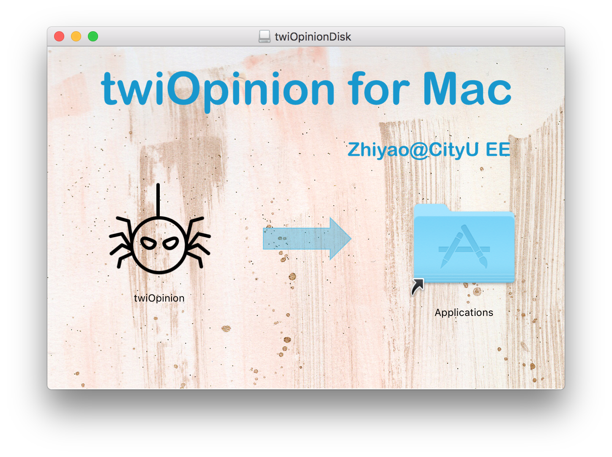
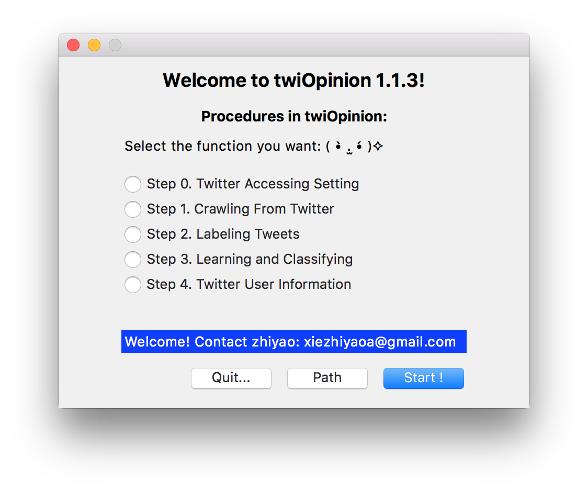
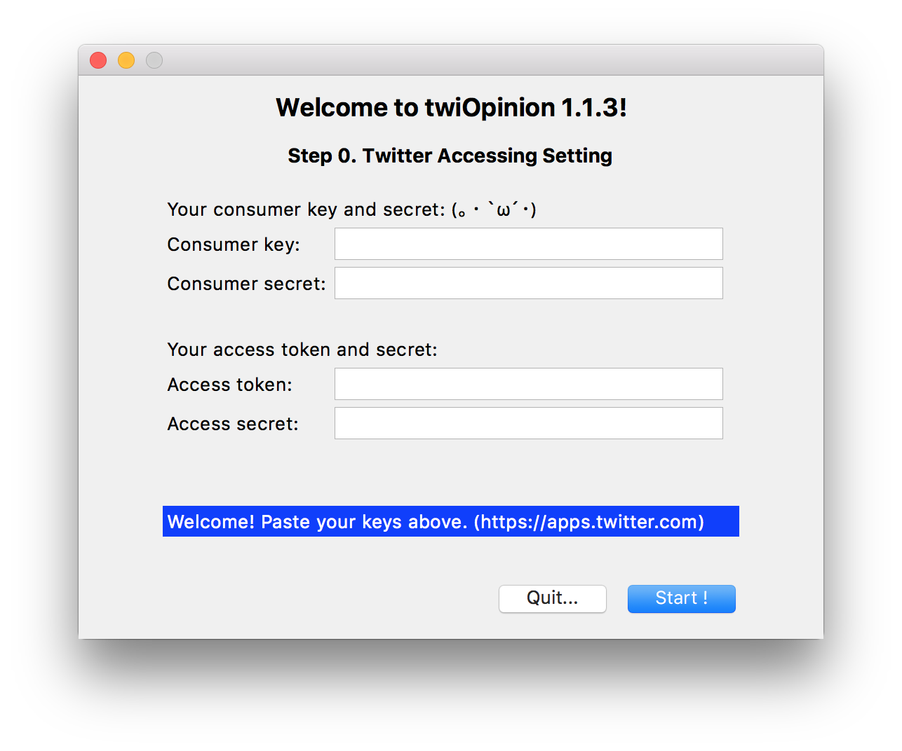
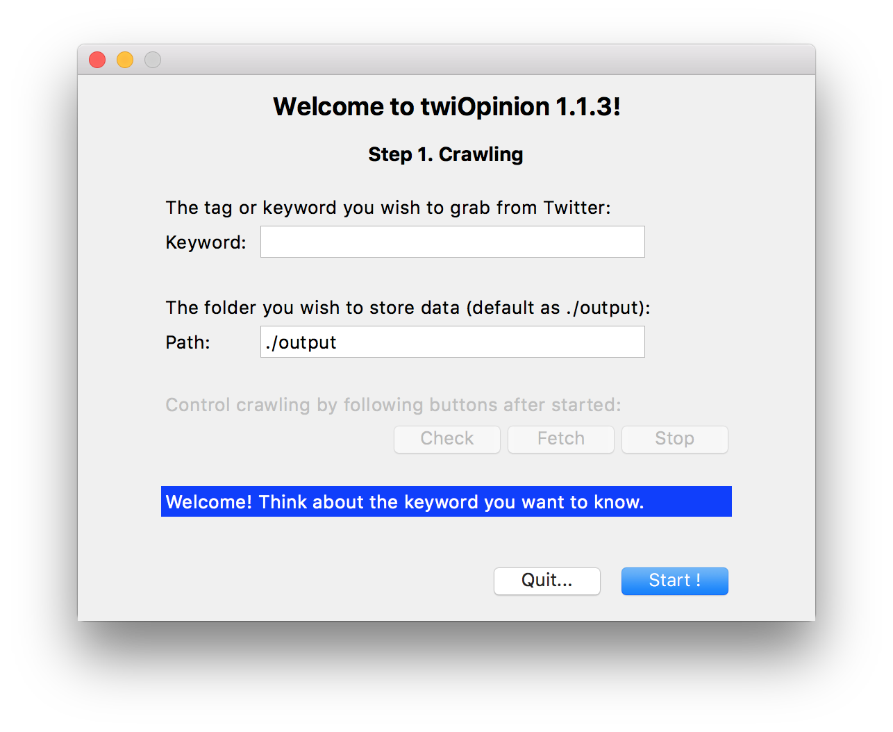
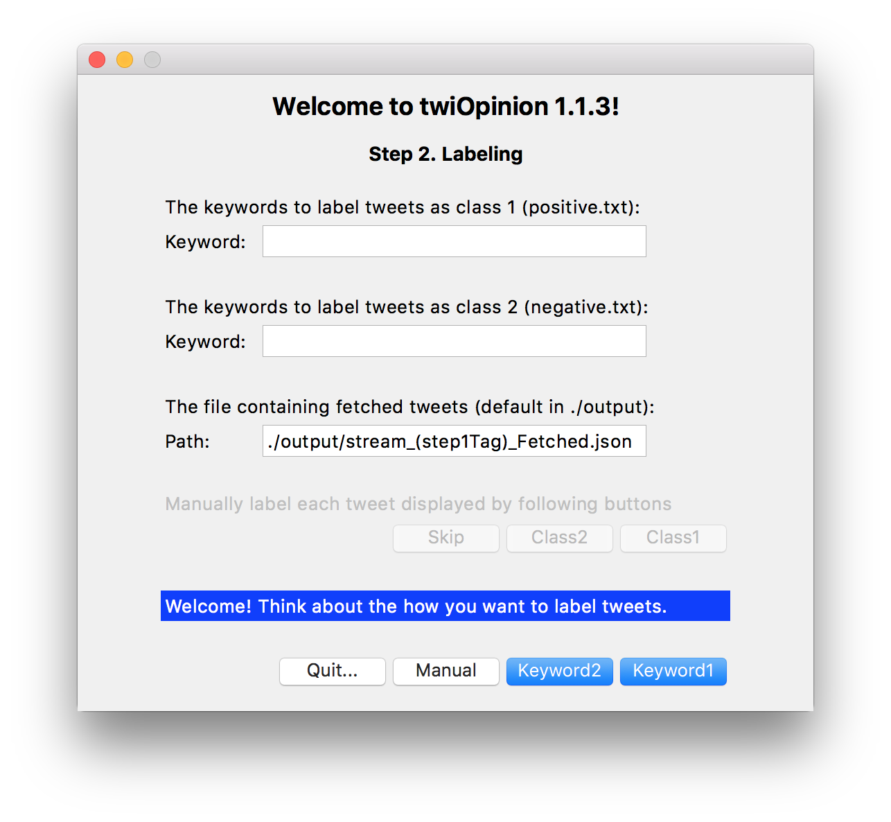

# twiOpinion
**twiOpinion** aims at enabling users without programming experience to learn about public opinion through Twitter.   

## Introduction
* It accesses Twitter, a social networking service, and performs classification by machine learning on tweets.  
* No programming skill is required. 
* Source code is written in Python only, graphics user interface is realized by 'Tkinter'. Third-party Python libraries involved: 'tweepy', 'guess\_language', 'nltk', 'pandas', 'sklearn', 'twitter'. 
* Both graphics user interface and command line interface are provided on operating systems including Linux, MacOS and Windows.  

## Installation
For Mac Users, click following link to download **twiOpinionDisk.dmg**:   
https://www.dropbox.com/sh/fvqerxiw8nbta8o/AABlKIQrV2LOoZ4eDDF8UHLIa?dl=1  

For Linux User, clone codes directly.  

## Usage
Helpful information will be displayed on the blue label at the bottom of each frame. Hover your mouse above buttons when you need more information.  

### Main function
* Select the function you like to use by selecting radiobuttons and click **Start!**.  
* Check your current working directory by clicking **Path**. Users are encouraged to do minor modifications on intermediate text files.  
* For Mac users: the working directory will usually be in subfolder of /Applications. To access it by 'Finder', right click /Applications/twiOpinion and click *'Show Package Contents'*   

### Function 0.  Twitter Accessing Setting
Generate the configuration file necessary for crawling Twitter: 
* 0.0. Create an Twitter account if you don't own one.  
* 0.1. Go to https://apps.twitter.com.  
* 0.2. Enter your application name, description and your website address.  
* 0.3. Submit the form by clicking the *'Create your Twitter Application'*   
* 0.4. Copy the keys and tokens into entries in Step 0 of **twiOpinion**  

### Function 1.  Crawling From Twitter
Crawl real-time tweets by the keyword/tag you indicated:  
* 1.0. Fill the tag/keyword you wish to crawl from Twitter in the first entry.  
* 1.1. Fill in the folder you wish to store crawled data in, which is default as "./output"  
* 1.2. Click **Start!** to start crawling real-time tweets. Wait till you get enough tweets. Output file named "stream\_(Keyword).json."  
* 1.3. Three buttons will be activated to control the crawling process now.  
* 1.4. Click **Check** to check number of tweets that have been crawled up to now.
* 1.5. Click **Fetch** to process crawled tweets, output files named "stream\_(Keyword)\_Fetched.json." and "stream\_(Keyword)\_Fetched.txt." Explain later 
* 1.6. Click **Stop** to do fetch firstly and then stop crawling and exit current function. 

### Function 2.  Labeling Tweets 
Label tweets into two classes by keywords or manully, which form the training set.
* 2.0. Input the file containing fetched tweets in the third entry, hint: replace "(step1Tag)" by the tag you set in previous crawling step.   
* 2.1. Decide whether label by different keywords or label manually.  
* 2.2. For labeling by keywords, input the conditions under which a tweet can be labeled into each class. You can indicate the condition by logical espression 'and', 'or', 'not'. For instance, when you have three keywords 'kA', 'kB', 'kC', the input can be: "kA and kB or not kC"   

### Function 3.  Learning and Classifying 

### Function 4.  Twitter User information 

## Built With
[py2app](https://py2app.readthedocs.io/en/latest/) - Make standalone Mac OS X application bundles and plugins from Python scripts.

## Author
[Zhiyao XIE](www.zhiyaoxie.com), City University of Hong Kong, EE. 

## License
This project is licensed under the MIT License - see the [LICENSE.md](LICENSE.md) file for details

## Acknowledgments
* Professor Tommy W.S. Chow
* Hadrien VAN LIERDE 
* Jia LI

