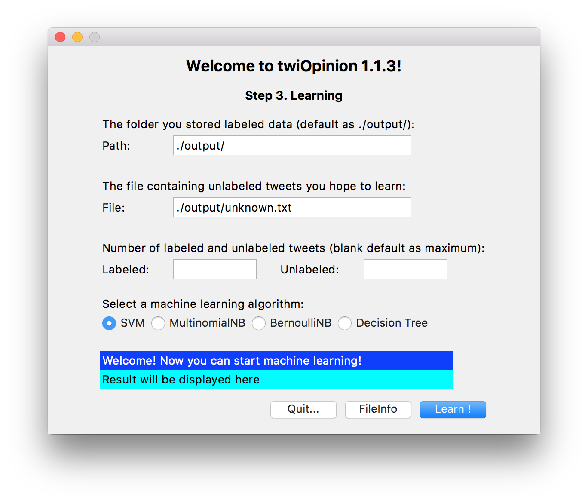
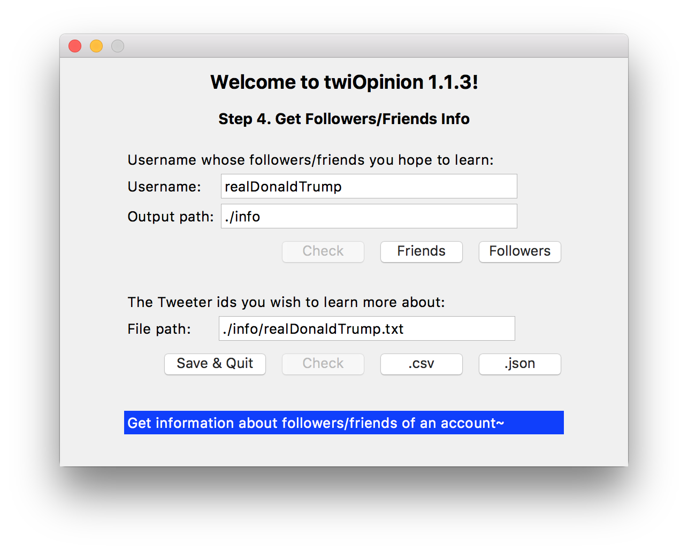

# twiOpinion
**twiOpinion** aims at enabling users without programming experience to learn about public opinion through Twitter.   

...This icon represents an intelligent spider :)

## Introduction
* It accesses Twitter, a social networking service, and performs classification by machine learning on tweets.  
* No programming skill is required.  
* Source code is written in Python only, graphics user interface is realized by [Tkinter](https://wiki.python.org/moin/TkInter).  
* Third-party Python libraries involved: [tweepy](http://www.tweepy.org), [guess\_language](https://pypi.python.org/pypi/guess_language-spirit), [nltk](https://www.nltk.org), [pandas](http://pandas.pydata.org), [sklearn](http://scikit-learn.org/stable/), [twitter](http://mike.verdone.ca/twitter/). 
* Graphics user interface version supports MacOS and Windows. 
* Both graphics user interface and command line interface versions support Linux.   

## Installation
For Mac Users, click following link to download **twiOpinionDisk.dmg**:   
https://www.dropbox.com/sh/fvqerxiw8nbta8o/AABlKIQrV2LOoZ4eDDF8UHLIa?dl=1  
Install simply by draging:

For Linux Users with graphics user interface, click following link to download scripts of **twiOpinion**:
https://www.dropbox.com/sh/dtrfom29f2mcevi/AADj-R0c8JNEg7-F1RWAVEGPa?dl=1  
Install required third party libraries following instructions in "src/Readme.txt" (pip recommended).  
Run "src/twiOpinion.py"  

## Usage
Helpful information will be displayed on the blue label at the bottom of each frame. Hover your mouse above buttons when you need more information.  

### Main function
* Select the function you like to use by selecting radiobuttons and click **Start!**.  
* Check your current working directory by clicking **Path**. Users are encouraged to do minor modifications on intermediate text files.  
* For Mac users: the working directory will usually be in subfolder of /Applications. To access it by 'Finder', right click /Applications/twiOpinion and click *'Show Package Contents'*   

### Function 0.  Twitter Accessing Setting
Generate the configuration file necessary for crawling Twitter: 
* 0.0. Create an Twitter account if you don't own one.  
* 0.1. Go to https://apps.twitter.com.  
* 0.2. Enter your application name, description and your website address.  
* 0.3. Submit the form by clicking the *'Create your Twitter Application'*   
* 0.4. Copy the keys and tokens into entries in Step 0 of **twiOpinion**  

#### Output Files in Function 0: *config.py*
* *config.py* is the file containing necessary tokens and keys enabling access to Twitter.

### Function 1.  Crawling From Twitter
Crawl real-time tweets by the keyword/tag you indicated:  
* 1.0. Fill the tag/keyword you wish to crawl from Twitter in the first entry.  
* 1.1. Fill in the folder you wish to store crawled data in, which is default as "./output"  
* 1.2. Click **Start!** to start crawling real-time tweets. Wait till you get enough tweets. Output file named "stream\_(Keyword).json."  
* 1.3. Three buttons will be activated to control the crawling process now.  
* 1.4. Click **Check** to check number of tweets that have been crawled up to now.
* 1.5. Click **Fetch** to process crawled tweets, output files: "stream\_(Keyword)\_Fetched.json." and "stream\_(Keyword)\_Fetched.txt." Explain later  
* 1.6. Click **Stop** to do fetch firstly and then stop crawling and exit current function. 

#### Output Files in Function 1: *stream\_(Keyword)\.json*, *stream\_(Keyword)\_Fetched.json*, *stream\_(Keyword)\_Fetched.txt*
* *stream\_(Keyword)\.json* contains raw crawled data.  
* *stream\_(Keyword)\_Fetched.json* contains tweets fetched from raw crawled data,  including keys like:   
statuses\_count (number of tweets this account posted)   
screen\_name (username of this account)  
friends\_count (number of friends of the account)   
text (text contens of this tweet)  
created\_at (account creation time)  
followers\_count (number of followers of the account) 
location (location of account, can be absent sometimes)  
* *stream\_(Keyword)\_Fetched.txt* contains text contens fetched from raw crawled data, which one-to-one correponds to the value of key "text" in *stream\_(Keyword)\_Fetched.json*.     

### Function 2.  Labeling Tweets 
Label tweets into two classes by keywords or manully, which form the training set.
* 2.0. Input the file containing fetched tweets in the third entry, hint: replace "(step1Tag)" by the tag you set in previous crawling step.   
* 2.1. Decide whether label by different keywords or label manually.  
* 2.2. For labeling by keywords, input the conditions under which a tweet can be labeled into each class. You can indicate the condition by logical espression 'and', 'or', 'not'. For instance, when you have three keywords 'kA', 'kB', 'kC', the input can be: "kA and kB or not kC".   
* 2.3. Set (different) keywords for both classes, then click **Keyword1** and **Keyword2**, corresponding to two classes. Error message will be displayed when your syntax error exist in your keywords espression, like "kA and kB or".  
* 2.4. Leaving keywords entry blank will lead to labeling all tweets into this class. This can be useful when all your crawled tweets actually belong to one class.  
* 2.5. Choose to label manully when it is difficult to distinguish two classes simply by keywords. Click **Manual** at the bottom to activate disabled "manually label" function.  
* 2.6. Tweets will be displayed at bottom in sequence, select **Class1**, **Class2**, **Skip** for each of tweet. Number of already labeled tweets for each class will be displayed at the blue label. 
* 2.7. Click **Quit&Save** when you want to stop. Based on my experience, the size of each class should be more than 100. This will be a tedious process thus backing up intermediate file is highly recommend, in case result gets rewritten.    

#### Output Files in Function 2: *positive.json*, *positive.txt*, *negative.json*, *negative.txt*
* *positive.json* contains tweets that are labeled as class 1, the same format as *stream\_(Keyword)\_Fetched.json* in Funtion 1.  
* *positive.txt* contains only text contents of tweets that are labeled as class 1, which one-to-one correponds to the value of key "text" in *positive.json*.    
* *negative.json* and *negative.txt* are the same type, only for tweets that are labeled as class 2.  

### Function 3.  Learning and Classifying 
Start classification by machine learning algorithms.  

### Function 4.  Twitter User information 
Get information about the followers/friends of certain account.  

### Tutorial Video
Check my demonstration video on YouTube:  
https://www.youtube.com/watch?v=Ozw7MR-ukY4&t=2s

## Built With
[py2app](https://py2app.readthedocs.io/en/latest/) - Make standalone Mac OS X application bundles and plugins from Python scripts.

## Author
[Zhiyao XIE](http://www.zhiyaoxie.com), City University of Hong Kong, EE. 

## License
This project is licensed under the MIT License - see the [LICENSE.md](LICENSE.md) file for details

## Acknowledgments
* [Professor Tommy W.S. Chow](http://www.ee.cityu.edu.hk/~twschow/)
* Hadrien VAN LIERDE 
* Jia LI

